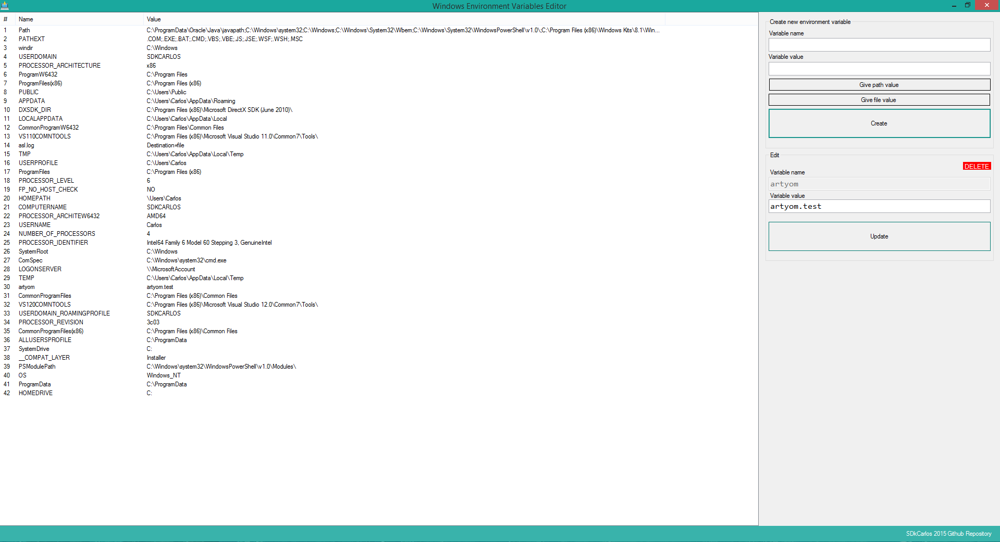

# Windows environment variables editor

A quick and useful .NET application for windows environment variables edition.

### Download the latest version here :

[Download latest PORTABLE version](https://github.com/sdkcarlos/WinEnvVariablesEditor/raw/master/Windows%20Environment%20Variables/bin/Debug/Windows%20Environment%20Variables.exe)

### The editor uses an easy and modern UI !

### Action Panel

Handle your variables with a couple of buttons that integrates a simple CRUD.

### Documentation

## Creation of variable

In the create new environment variable groupbox , give a name to your variable.  
In the value box you can give a custom value (numeric, string .. etc) or give a path :   
Use "Give path value" to open a folderbrowser , choose a path and set it as value of your variable.  
Finally, click on create and your variable will be already available on windows !  
[Note: The actives command prompt will not notice the variable exist until you restart it (a cmd.exe window or the application itself)]

## Edition of variable

In the edit groupbox, change the value of a existing variable. 
If you need to change the name, delete the variable and then create a new one.  
Click on update and confirm the question !

# Have fun !

@version 1.0 (08.08.2015)
